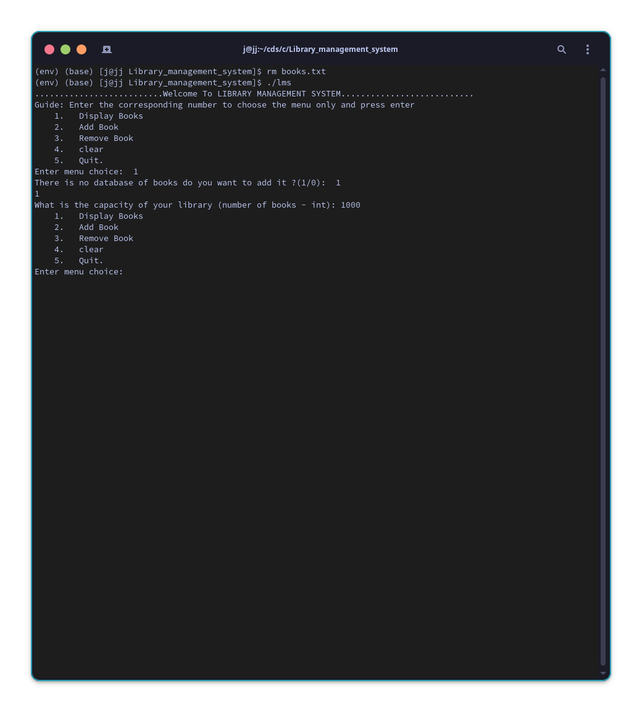
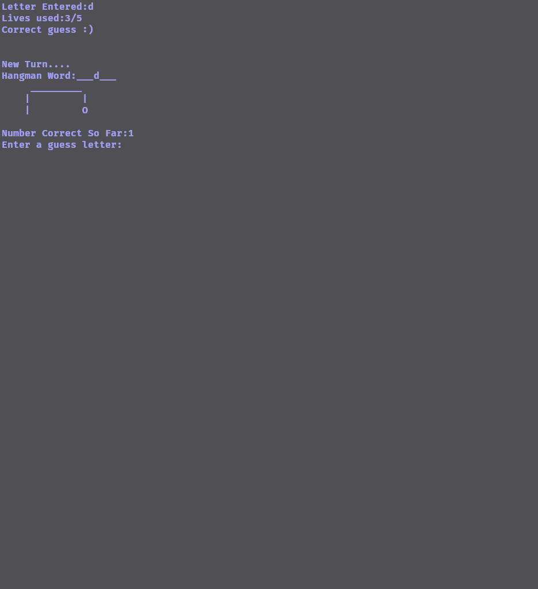
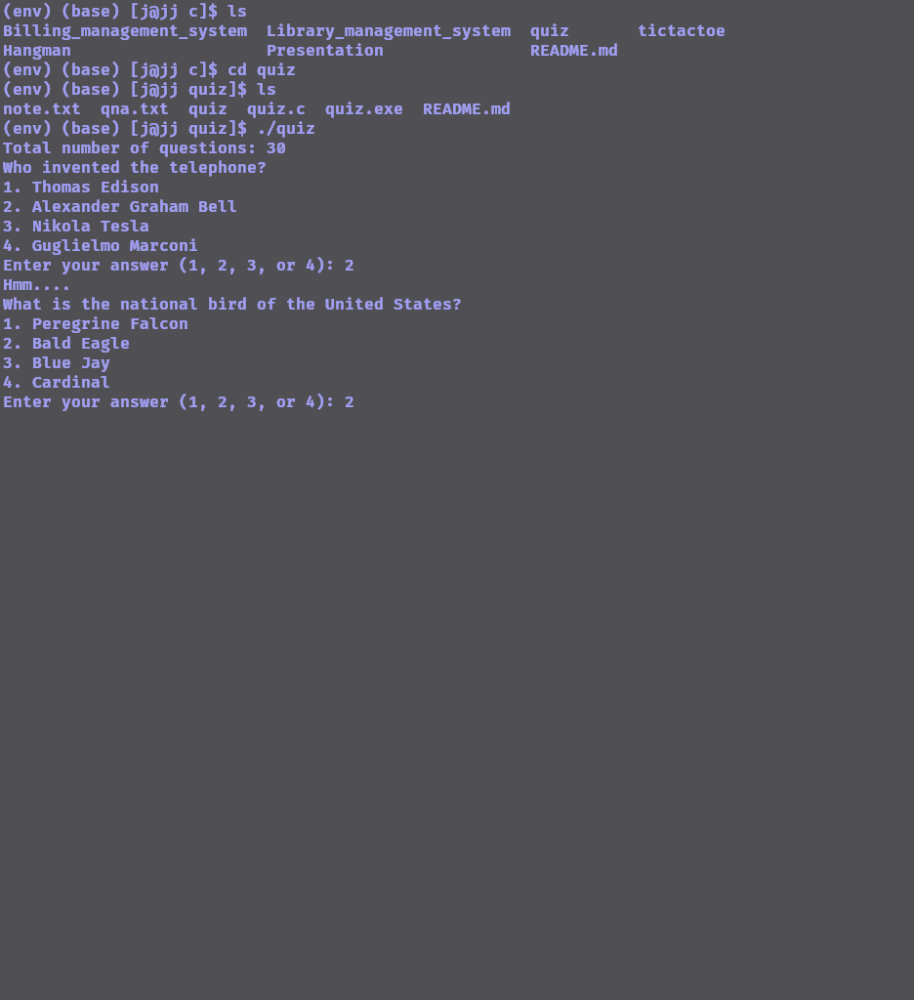
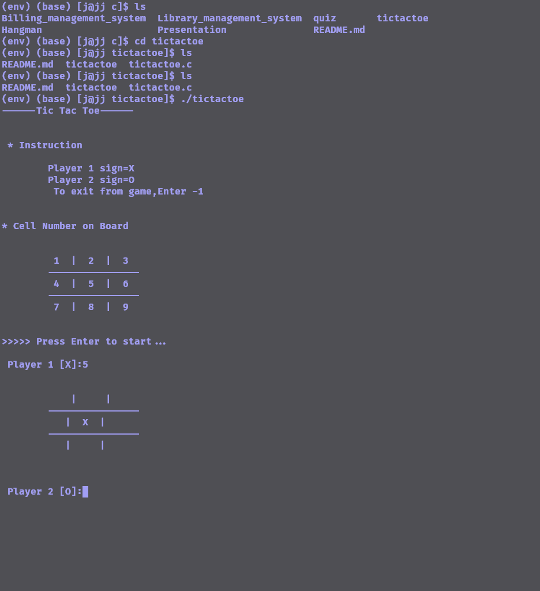

# Library Management System

---

- library management system is a small project
- used to store book information
- uses file handling
- creates books.txt file
- stores the book information in the books.txt file
<!-- end_slide -->

# Features of Library Management System

---

<!-- pause -->

## Display books

- creates book.txt if not found
- if found displays books in table

<!-- pause -->

## Add books

- return error if book.txt is not found so you need to display books first

<!-- pause -->

## Remove books

- remove book by name
- remove book by id

<!-- pause -->

## Clear the screen

<!-- pause -->

## Quit

<!-- pause -->

## \*\* This project assigns a unique id to each book but not serial not

<!-- end_slide -->

---

# Algorithm of Library Management System

---

<!-- end_slide -->

---

# before running program

---

- include libraries
- define files
- define structures
- protype the function
<!-- end_slide -->

---

# Main

---

- say welcome
- display main menu
<!-- end_slide -->

---

# main menu

---

- show options
  {

1. display books
2. add books
3. remove books
4. clear
5. quit
}
-if 1,2,3,4,5 then display books, add books, remove books, clear, quit
-else say error
<!-- end_slide -->

---

# display books

---

- checkDB
- if there is DB then display books by skipping the first line
- else if there is no DB then createDB

<!-- pause -->

## createDB

- make a file named books.txt namely books
- ask for the capacity of library and add it to the first line
- show the books by skipping the first line that contains capacity
<!-- end_slide -->

---

# add books

---

- open books in append mode
- if checkDB return 1 then append books
- else createDB then append books

<!-- pause -->

## append books

- open books in append mode
- get the last id from the books.txt

<!-- pause -->

### get last id

- skip first line that has capacity
- iterate upto last line while putting the value for last id(
  the last iteration will give the last id )
- return lastid
- ask for book name, book author
- this books id = lastid + 1
- put these information in the file
<!-- end_slide -->

---

# remove book

---

-open books in read mode

- open temp file in write mode
- ask if user want to remove by id or name
- if by name them remove book by name
- if by id then remove book by id
<!-- end_slide -->

---

# remove book by id

---

- open books in read mode
- open temp file in write mode
- copy capacity of book to temp file
- iterate{
  - check if the id of the book mathches the id specified by the user
  - if not matches, write the book to the temp file
  - if matches, dont write the book to the temp file
- remove the books.txt
- rename the temp.txt to books.txt
}
-close books
<!-- end_slide -->

---

# remove by name

---

- open books in read mode
- open temp file in write mode
- copy capacity of book to temp file
- iterate{
  - check if the name of the book mathches the name specified by the user
  - if not matches, write the book to the temp file
  - if matches, dont write the book to the temp file
- remove the books.txt
- rename the temp.txt to books.txt
}
-close books
<!-- end_slide -->

---

# clear

---

- tell system terminal (bash) to clear the screen
<!-- end_slide -->

---

## quit

---

- quit the program
<!-- end_slide -->

---

# Screenshot

---

<!-- end_slide -->

---

<!-- end_slide -->

---

# Billing Management System

---

- Uses structures
- phone billing System

<!-- end_slide -->

---

# Features

---

- show the total bill

<!-- pause -->

- add bill

<!-- pause -->

- remove bill

<!-- pause -->

- calculate cost for minutes of call

<!-- end_slide -->

---

# Algorithm for Billing Management System

---

<!-- end_slide -->

---

# Algorithm for Operations

---

<!-- pause -->

## 1. Adding a New Record (`addRecord` Function)

- Prompts the user to input customer information (name, phone number, and usage in minutes).
- Calculates the total bill based on usage.
- Adds the new record to the `customers` array.

<!-- pause -->

## 2. Viewing List of Records (`viewRecords` Function)

- Prints a table header.
- Iterates through the `customers` array and prints each customer's information.

<!-- pause -->

## 3. Modifying a Record (`modifyRecord` Function)

- Takes a phone number as input to identify the record to be modified.
- Prompts the user to enter the new usage in minutes.
- Updates the total bill based on the new usage.

<!-- pause -->

## 4. Viewing Payment (`viewPayment` Function)

- Takes a phone number as input to identify the record to be viewed.
- Prints the name, phone number, usage, and total bill for the specified customer.

<!-- pause -->

## 5. Deleting a Record (`deleteRecord` Function)

- Takes a phone number as input to identify the record to be deleted.
- Shifts the remaining records to fill the gap created by the deleted record.

<!-- pause -->

## 6. Displaying Menu and Main Loop (`displayMenu` and `main` Functions)

- Displays a menu with options for different operations.
- Takes user input to execute the chosen operation.
- The program continues to run until the user chooses to exit.
<!-- end_slide -->

---

# Screenshot of Billing Management System

---

<!-- end_slide -->

---

# Hangman game

---

- simple hangman game
<!-- end_slide -->

---

# Hangman Game Algorithm

---

<!-- end_slide -->

---

# Initialization:

---

- Import necessary libraries (`stdio.h`, `stdlib.h`, `string.h`, `ctype.h`, `time.h`).
- Declare function prototypes for `drawHangman` and `strlwr`.
- Define `main` function:
  - Declare variables and arrays for the game: - `choice` for user input to play again. - `guessWords` array containing words for the game. - `randomIndex` to randomly select a word index. - `numLives` for tracking remaining lives. - `numCorrect` for counting correct guesses. - `oldCorrect` to compare with `numCorrect` for wrong guesses. - `lengthOfWord` for the length of the selected word. - `letterGuessed` array to track guessed letters. - `quit` to determine if the user quit early. - `loopIndex` for iterating over the word. - `reguessed` to check if a letter has been guessed before. - `guess` array to store user input. - `letterEntered` to store the guessed letter.

<!-- end_slide -->

---

# Game Loop:

---

<!-- pause -->

- Start a do-while loop to allow multiple game plays.

  - Seed the random number generator with `srand(time(NULL))`.

<!-- pause -->

- Randomly select a word index (`randomIndex`) from `guessWords`.

<!-- pause -->

- Initialize game variables (`numLives`, `numCorrect`, `oldCorrect`, etc.).

<!-- pause -->

- Start a while loop for each turn of the game until the word is guessed or lives run out.

  - Display the current state of the word with underscores for unguessed letters.

  - Display the hangman figure based on the number of incorrect guesses.

  - Prompt the player for a letter guess.

  - Convert the guess to lowercase using the `strlwr` function.

  - Check if the player wants to quit (`strncmp(guess, "quit", 4)`).

  - Clear the console screen (`system("clear")` or `system("cls")`).

  - Process the user's guess:

  - Check if the letter has already been guessed.

  - Update the game state based on the guess.

  - Check if the player has won or lost.

  - If the player wants to quit, exit the loop.

- Display the game result (win, lose, or quit).

<!-- pause -->

- Ask the player if they want to play again (`printf("\nDo you want to Play Again?(Y/N)\n")`).

<!-- pause -->

- Read the player's choice into the `choice` variable.

<!-- pause -->

- Continue the loop if the player wants to play again (`while (choice == 'Y' || choice == 'y')`).

<!-- end_slide -->

---

# Drawing the Hangman:

---

- Implement the `drawHangman` function to display the hangman figure based on the number of lives.

<!-- end_slide -->

---

# Convert String to Lowercase:

---

- Implement the `strlwr` function to convert a string to lowercase.

<!-- end_slide -->

---

# End of Program:

---

- Return 0 from the `main` function.

<!-- end_slide -->

---

# Screenshot for Hangman

---

<!-- end_slide -->

---

# Quiz game

---

- play a simple quiz game
- uses file handling
- creates qna.txt file
- stores the questions and answers in the qna.txt file

<!-- end_slide -->

---

# Features of Quiz game

---

- quiz game with questions and answers
- display questions
- display answers
- display score
- save score

<!-- end_slide -->

---

# Algorithm of Quiz game

---

<!-- end_slide -->

---

# before running the function

---

- include libraries of string ctypes stdio stdlib
- include qna.txt which contains question,4 options,corresponding_correct_answer_no
- define functions tolower

# toLowercase \*str(call by reference)

- initialize i = 0
- iterate over the string
  - lower the character

<!-- end_slide -->

---

# get_no_of_question

---

- open qna
- init i = 0
- while seeing question, 4 options, and the correct answer increase i
- print no of question
- return no of question

<!-- end_slide -->

---

# MAIN FUCTION

---

- init score = 0, noofq = get_no_of_questions
- open qna
- loop init i = 0 upto less than no of questions with increment of one question
  - see i th line of qna
  - print questions then options
  - take user input as answer
  - if answer == correct option increase score
  - else go to next question
- float percentage = score/noofq \* 100
- if percentage == 100 >> perfect score
- else if >= 80 >> excellent score out of noofq
- else if >= 60 >> good score out of noofq
- else if >= 40 >> satisfactory score out of noofq
- else if < 40 >> failed score out of noofq
- else >> something went wrong
- return 0

<!-- end_slide -->

---

# Screenshot for quiz

---

<!-- end_slide -->

---

# Tic Tac Toe Game

---

- uses 2D array to display the game
- uses indexing to input the position of player X or 0

<!-- end_slide -->

---

# Algorithm of Tic Tac Toe Game

---

<!-- end_slide -->

---

# Initialization

---

- Define a 3x3 character array `board` to represent the Tic Tac Toe board.
- Implement the `initializeBoard` function to initialize the board with empty spaces and display cell numbers.
- Create a main function (`main`) to set up the game, display instructions, and start the game loop.

<!-- end_slide -->

---

# Display Functions

---

## `initializeBoard` Function

- Initialize the `board` array with empty spaces.
- Display the initial board layout with numbered cells.

## `showBoard` Function

- Display the current state of the Tic Tac Toe board.

<!-- end_slide -->

---

# Update Board

---

## `updateBoard` Function

- Take a cell number and player's sign as input.
- Calculate the corresponding row and column for the cell number.
- Check if the selected cell is already filled; if not, update the board with the player's sign.
- Display the updated board.

<!-- end_slide -->

---

# Check Winner

---

## `checkWinner` Function

- Check for winning conditions in rows, columns, and diagonals.
- Return 1 if a player has won; otherwise, return 0.

<!-- end_slide -->

---

# Game Loop

---

## `playTicTacToe` Function

- Initialize variables for game results, selected cell, play count, and update result.
- Alternate turns between Player 1 (X) and Player 2 (O).
- Accept user input for cell selection.
- Update the board and check for a winner after each move.
- Display the result at the end of the game.

<!-- end_slide -->

---

# Main Function

---

- Display game instructions and initial board.
- Wait for user input to start the game.
- Start the game loop.
- Provide a menu for restarting or exiting the game.
- Continue playing or exit based on user choice.

<!-- end_slide -->

---

# Termination

---

- Thank the player for participating.

<!-- end_slide -->

---

# Execution

---

- Compile and run the program.
- Follow on-screen instructions to play Tic Tac Toe.
- Terminate the game or restart based on user input.

<!-- end_slide -->

---

# Screenshot for Tic Tac Toe

---

<!-- end_slide -->

---

# Any Queries??

---

<!-- end_slide -->
